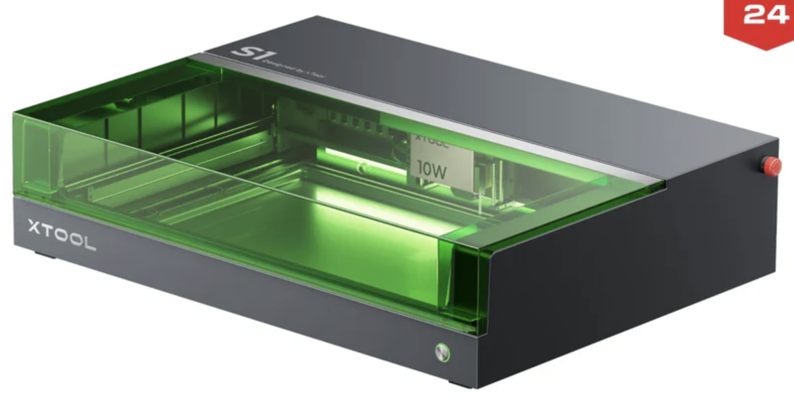

[Main](README.md) | [Access](access.md) | [Equipment List](equipment.md) | 
------------------------
[Makerspace website](https://codeuniversity.github.io/makerspace/) |
[Makerspace github repo](https://github.com/codeuniversity/makerspace/) | [Makerspace Slack channel](https://codeuniversity.slack.com/archives/C011CN2SMFY)

------------------------

# Laser Cutter xTool S1 40w

https://www.xtool.com/products/xtool-s1-laser-cutter

Getting started with the xTool S1 laser cutter

You can see the range of current user support materials and guides from xTool here
[xTool support centre](https://support.xtool.com/article/1106?from=learning-center)

and you can download the introduction pdf help guide here [xTool S1 intro pdf](English-xTool-S1-Quick-Start-Guide.pdf)

 

 
