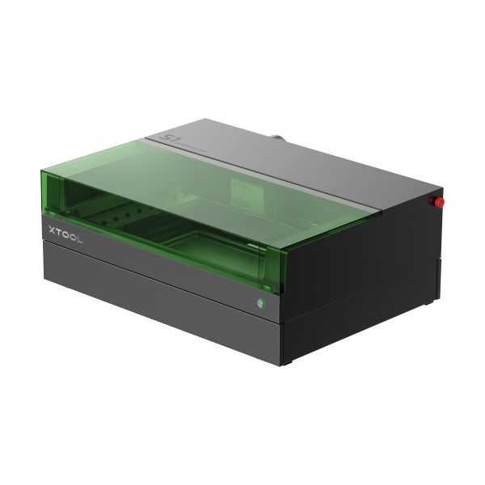
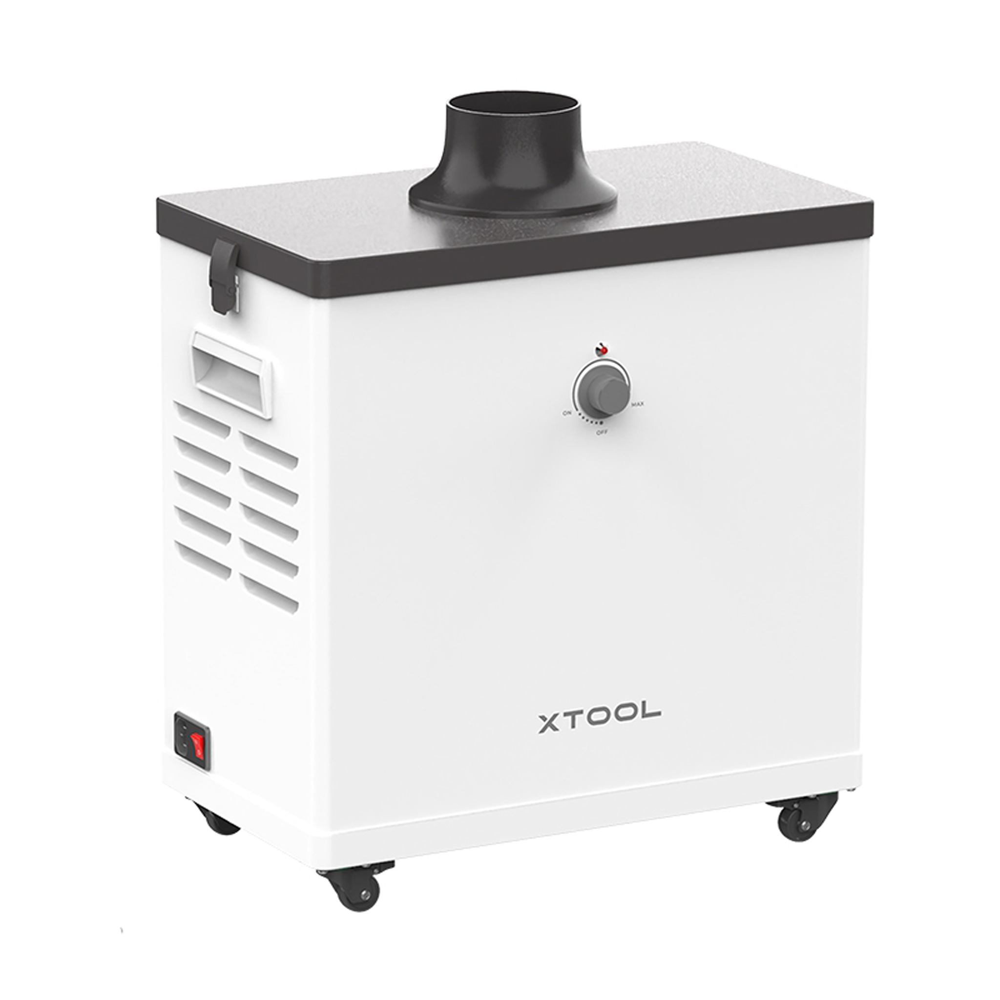

## [Main](README.md) | [Access](access.md) | [Equipment List](equipment.md) |

[Makerspace website](https://codeuniversity.github.io/makerspace/) |
[Makerspace github repo](https://github.com/codeuniversity/makerspace/) | [Makerspace Slack channel](https://codeuniversity.slack.com/archives/C011CN2SMFY)

---

# Index

1. Intro
2. Equipment List
3. Getting Started
   1. Requirements
   2. Software and Setup
   3. Using the Machine
4. Safety
5. Booking
6. Common Issues

# 1. Intro

Before using the laser cutter you MUST attend the laser training session run by CODE, along with completing the CODE laser safety questionnaire.

Laser cutters are an effective way to cut and engrave various materials, most commonly wood, wood composites, and Acrylic. It uses a high power laser to vaporise the target material following the user's design.

# 2. Equipment List

All three of these pieces of equipment must be present and active during usage:

### 1. Laser Cutter: [xTool S1](https://www.xtool.com/products/xtool-s1-laser-cutter), with [40w diode laser module](https://www.xtool.com/products/xtool-s1-40w-laser-module) and [Riser Base](https://www.xtool.com/products/xtool-s1-riser-base).

This documentation will cover basic usage of the xTool s1 in the makerspace.

You can see the range of current user support materials and guides from xTool [here](https://support.xtool.com/article/1106?from=learning-center).

### 2. Fire Suppression System: [xTool Fire Safety Set](https://www.xtool.com/products/fire-safety-set).

Make sure that the CO2 indicator is NOT flashing, before use of the machine. This indicates that the CO2 canisters have been used and need replacing. Please tell a relevant member of faculty if this is the case so it can be replaced before use of the machine.

The single-use fire safety set on top of the machine uses 4 large CO2 canisters to effectively extinguish a fire. When the lid is down, this system is good at putting out medium to large sized contained fires within the machine.

To manually trigger the fire suppression system if required, press the FRONT button once. This will activate the fire suppression.

For more information, the fire safety set user guide can be found [here](https://support.xtool.com/article/1145#qNpmX).

### 3. Ventilation: [xTool Smoke Purifier](https://support.xtool.com/article/621).

The xTool Smoke Purifier must be switched on at the back and the dial turned up so that it is in a working state before using the laser cutter. The tube coming out of the back must be positioned so that it points OUTSIDE of the building (through the window).

Turn off the purifier after finishing with the laser cutter.

More information about the xTool Smoke Purifier can be found [here](https://support.xtool.com/article/621)

# 3. Getting Started

If you have not completed the CODE laser cutter training session and safety questionnaire, DO NOT attempt to use the machine.

### Requirements

To use the machine, you will need the following:

1. The key to the laser cutter (can be booked, see "5. Booking").
2. A laptop with xTool Creative Space software installed (download can be found [here](https://www.xtool.com/pages/software)).
3. A free USB type A port (or adapter).
4. A secondary person present in the room whilst the machine is active.

### Software and Setup

The [xTool Creative Space software](https://www.xtool.com/pages/software) requires an account to be made to verify that you have received the additional xTool training, which consists of a single video running through some basic safety information. You can run through this training by clicking the badge under your account name, otherwise it will trigger if you attempt to use the machine for the first time.

Upon completing the xTool training, you will receive a digital certificate. You may download this if you wish.

Click on "New Project" in the top right of the application. It may guide you through a basic tutorial. More tutorials can be found on YouTube, such as [this one by Creative Ramblings](https://www.youtube.com/watch?v=1N66RNpKtDc) if you wish to see more examples.

Once you have verified that:

1. The fire safety set does NOT have a CO2 warning
2. The ventilation is turned on with the exhaust facing OUTSIDE of the building
3. There is no damage to the laser cutter or lid

you may switch on the laser cutter and plug the USB A cable into your laptop.

### Using the xTool s1

The xTool s1 will not work without the physical key. The key can be booked as required. (see "5. Booking")

The machine's on and off switch can be found at the back of the machine on the right, as well as the key slot. You will also find an emergency off switch on the right hand side.

The machine uses loud beeps to indicate recognition of change (e.g.: turning on, plugging in a USB, sending a job, pausing a job, etc). The front LED also indicates the various states of the machine.

The honeycomb plate must be placed inside the machine, positioned all the way to the right, and all the way to the front.

1. Connect the Machine:
   Once the xTool s1 is plugged into your laptop, the software should recognise it. If it does not automatically connect, click the connection button on the right and select the machine from the list.

2. Position Material and Laser:
   You may place your desired material on top of the honeycomb plate, and position the laser head by hand so that it is somewhere on top of the material, indicated by the red + guiding laser. You will see that the software will update to the same location.

3. Change Settings:
   You can select the same material inside the software, which will change the speed and power of the laser during cuts, scoring and engraving. Feel free to play around with these values, but for safety reasons it's best to start with a lower power and medium speed, and if it is not enough then you can do multiple passes.

4. Auto Measure Material Height:
   Close the lid and click the auto measure button at the top to probe the height of the material at the location of the guiding laser.

5. Verify Placement of the Design:
   Position your design as required, then click "framing" to send a preview job to the laser cutter. Press the button on the front of the machine to see a traced rectangular outline of where the laser cutter will operate.

6. Confirm and Start Job:
   Adjust the design as needed, and once you are happy with the framing, click start, then press the button on the front to begin laser cutting.

7. Finish and Tidy:
   Once the machine has stopped fully, wait until the internal fans stop and the smoke is clear, then open the lid and remove your finished cut. Remove all debris that may have dropped through the honeycomb plate, turn off the machine and purifier, and return the key.

# 4. Safety

Some materials are NOT safe to laser cut. Always check that you know what material you are using, and that it will not produce any toxic fumes.

### Fires

Some very small fires will go away on their own or with a light blow. Opening the lid and blowing it out manually will automatically stop the laser.

In the case of a small->medium fire, use the fire safety box located on top of the machine. Press the button on the front of the fire safety box once to trigger two bursts of CO2.

If a fire does not go out with the fire safety box, or it is not safe for you to use it, use a fire extinguisher. If it gets out of control, pull the fire alarm and inform a member of faculty as soon as possible.

After any fire or damage to the machine, inform a relevant member of faculty and cease any use of the machine before it is inspected by a professional.

Never leave the room whilst using the machine.

Never use the machine without someone else present in the room. If they leave, pause the job.

# 5. Booking

Booking the machine is currently not possible. Please talk to Daniel Buzzo if you would like to use the machine before a booking system is implemented.

Last updated 30/07/2025

