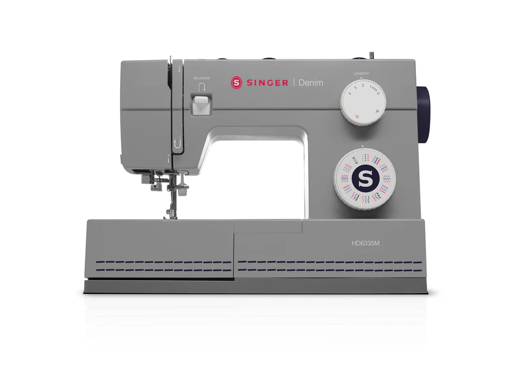

## [Main](README.md) | [Access](access.md) | [Equipment List](equipment.md) |

[Makerspace website](https://codeuniversity.github.io/makerspace/) |
[Makerspace github repo](https://github.com/codeuniversity/makerspace/) | [Makerspace Slack channel](https://codeuniversity.slack.com/archives/C011CN2SMFY)

---

# SINGER Heavy Duty 6335M Denim Sewing Machine

The MakerSpace currently has a SINGER Heavy Duty 6335M Denim sewing machine.

_adapted from Singer forum induction_

The SINGER Heavy Duty 6335M is a robust machine, ideal for sewing denim and other heavy fabrics. It is reliable and offers excellent stitch quality. However, like any machine, it requires some learning and practice to master.

You can find the machine on the official Singer website [here](https://europe.singer.com/products/singer-heavy-duty-hd6335-denim-sewing-machine-de?srsltid=AfmBOoqEkfS91m4EEiPqVWksZxMaUbmc8i5inYGb12L0DhR3xvMNNM4N&variant=49432649335063/).

Please download and read the Singer manual for safe and reliable machine operation:

- [English Manual](https://svpworldwide.widen.net/content/rb9cperp24/pdf/HD6335M-Manual.pdf?u=cko5pg)
- [German Manual](http://www.singerdeutschland.de/fileadmin/user/upload/HeavyDuty/Anleitung_HD_6335.pdf)

## Do's and Don'ts

### Do's

1. Always thread the machine with the presser foot up.
2. Use the correct needle and thread for your fabric.
3. Regularly clean and oil the machine as per the manual instructions.

### Don'ts

1. Do not pull the fabric while sewing; let the machine feed it.
2. Avoid using bent or dull needles.
3. Do not operate the machine without proper lighting.

## Sewing Machine 101

If you haven't used a sewing machine before, start with these steps:

1. Familiarize yourself with the machine parts and their functions.
2. Practice threading the machine and winding the bobbin.
3. Start with simple stitches on scrap fabric to get a feel for the machine.

## Common Issues and Troubleshooting

### Common Issues

1. **Thread Bunching:** Ensure the machine is threaded correctly and the tension is set properly.
2. **Skipped Stitches:** Check the needle; it might be bent or dull.
3. **Machine Jamming:** Clean the bobbin area and remove any lint or thread buildup.

### FAQs

1. **What type of needle should I use for denim?**
   - Use a size 16/100 or 18/110 needle for heavy fabrics like denim.
2. **How often should I oil the machine?**

   - Refer to the manual, but generally, oil the machine after every 10 hours of use.

3. **Can I sew lightweight fabrics with this machine?**
   - Yes, but adjust the tension and use the appropriate needle and thread.
