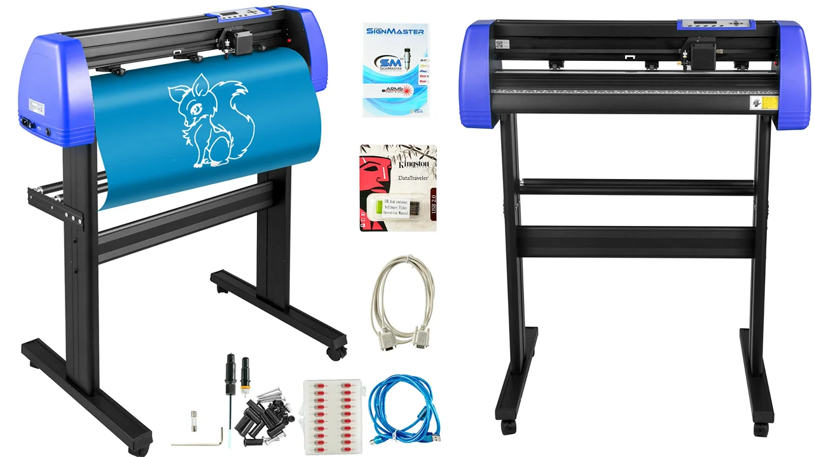

## [Main](README.md) | [Access](access.md) | [Equipment List](equipment.md) |

[Makerspace website](https://codeuniversity.github.io/makerspace/) |
[Makerspace github repo](https://github.com/codeuniversity/makerspace/) | [Makerspace Slack channel](https://codeuniversity.slack.com/archives/C011CN2SMFY)

---

# Vinyl Cutter — Vevor KH-720A

- [User Guide](https://d2v0huudrf11kh.cloudfront.net/1619602834849.pdf)
- Use [SignMaster](https://www.signmaster.software/) to control the cutter
- On Macs, you'll need a Windows VM that **supports host USB connectivity**; [vmware Fusion](https://www.vmware.com/products/desktop-hypervisor/workstation-and-fusion) works well (free for personal use)
- Use transfer foil to transer the vinyl from the roll to your medium

## Introduction

The VEVOR KH-720A vinyl cutter is a versatile machine used for cutting vinyl and other materials for creating signs, decals, and more. For detailed specifications and user guides, please refer to the [VEVOR Manual](https://www.vevor.com/diy-ideas/vinyl-cutter-manual-guide-pdf/) and the [Product Page](https://eur.vevor.com/vinyl-cutter-c_11151/vevor-vinyl-cutter-720mm-vinyl-plotter-led-guide-light-signcutlabel-maker-p_010471543700).

## Basic Understanding

A vinyl cutter is a computer-controlled machine that uses a blade to cut out shapes and letters from sheets of thin self-adhesive plastic (vinyl). The VEVOR KH-720A model is known for its precision and ease of use, making it ideal for both beginners and professionals.

  

  

## Do's and Don'ts

### Do's

1. Ensure the machine is properly set up and calibrated before use.
2. Use the correct blade and settings for the material you are cutting.
3. Regularly clean the machine to maintain its performance.

### Don'ts

1. Do not force the material into the machine; ensure it feeds smoothly.
2. Avoid using damaged or worn-out blades.
3. Do not leave the machine unattended while in operation.

## Setup and Operation

1. Connect the vinyl cutter to your computer and install the necessary software.
2. Load the vinyl material onto the machine, ensuring it is aligned correctly.
3. Select the design to be cut and adjust the settings as needed.
4. Start the cutting process and monitor the machine for any issues.

## Troubleshooting

- **Material not cutting properly:** Check the blade and adjust the cutting pressure.
- **Machine not responding:** Ensure all cables are connected and the software is installed correctly.

For more troubleshooting tips, visit the [VEVOR Troubleshooting Guide](https://www.vevor.com/diy-ideas/vinyl-cutter-manual-guide-pdf/).

## FAQs

1. **What materials can I cut with this machine?**
   - The VEVOR KH-720A can cut vinyl, paper, cardstock, and more.
2. **How do I change the blade?**
   - Refer to the manual for step-by-step instructions on changing the blade.

## Additional Resources

- [VEVOR Official Website](https://www.vevor.com)
- [VEVOR Support](https://www.vevor.com/support)

